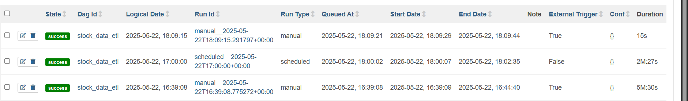

# Stock Data ETL with Airflow and PostgreSQL

An end-to-end project to demonstrate real-time stock data extraction, transformation, and loading using Python, PostgreSQL, Apache Airflow, and Docker.

---

## 📌 Table of Contents

* [Overview](#overview)
* [Tech Stack](#tech-stack)
* [Project Structure](#project-structure)
* [Features](#features)
* [Setup Instructions](#setup-instructions)

  * [1. Clone the Repository](#1-clone-the-repository)
  * [2. Create Local PostgreSQL Instance (Optional)](#2-create-local-postgresql-instance-optional)
  * [3. Start Airflow with Docker](#3-start-airflow-with-docker)
  * [4. Load Data Locally (Optional Script Test)](#4-load-data-locally-optional-script-test)
  * [5. Schedule and Trigger with Airflow](#5-schedule-and-trigger-with-airflow)
* [Project Flow](#project-flow)
* [Screenshots](#screenshots)
* [License](#license)

---

## ✅ Overview

This project fetches hourly stock market data from the Alpha Vantage API for a selected stock (e.g., AAPL). It processes the data and stores it into a PostgreSQL database. The entire ETL process is scheduled and managed using Apache Airflow running in Docker containers.

---

## 🧰 Tech Stack

* **Python**
* **PostgreSQL**
* **Apache Airflow**
* **Docker & Docker Compose**
* **Alpha Vantage API**
* **Pandas**
* **SQLAlchemy**

---

## 📁 Project Structure

```
project-root/
├── airflow/
│   ├── dags/
│   │   └── stock_etl_dag.py
│   ├── etl/
│   │   └── fetch_stock_data.py
│   ├── docker-compose.yaml
├── etl/
│   └── fetch_stock_data.py      # Local version for manual testing
├── README.md
└── docker-compose.yaml         # PostgreSQL setup
```

---

## 🌟 Features

* Fetches hourly stock data using the Alpha Vantage API.
* Loads structured data into PostgreSQL.
* ETL job scheduled and orchestrated using Airflow.
* Modular Python ETL scripts.
* Configurable and extendable setup using Docker.

---

## 🧑‍💻 Setup Instructions

### 1. Clone the Repository

```bash
git clone https://github.com/OsamaMushtaq/Automated-Stock-Market-ETL-Pipeline-with-Airflow-and-PostgreSQL.git
cd stock-etl-airflow
```

### 2. Create Local PostgreSQL Instance (Optional)

Only required for local testing outside Airflow:

```bash
docker-compose up -d
```

Verify with:

```bash
docker ps
```

### 3. Start Airflow with Docker

Navigate to the `airflow/` folder:

```bash
cd airflow
docker-compose up -d
```

Access Airflow UI at: [http://localhost:8080](http://localhost:8080)
Default credentials:

* Username: `airflow`
* Password: `airflow`

### 4. Load Data Locally (Optional Script Test)

Edit and run `etl/fetch_stock_data.py` to test the ETL process without Airflow:

```bash
python etl/fetch_stock_data.py
```

This fetches data and loads it into your local PostgreSQL.

### 5. Schedule and Trigger with Airflow

1. Go to Airflow UI > DAGs.
2. Enable the `stock_data_etl` DAG.
3. Click ▶️ (Trigger DAG) to run it immediately.
4. Monitor execution under "Graph View" and view logs.

---

## 🔁 Project Flow

```text
Alpha Vantage API
       |
       v
Fetch Stock Data (Python)
       |
       v
PostgreSQL (Raw Table)
       |
       v
Airflow (Schedules ETL every hour)
```

---

## 🖼️ Airflow DAG List


